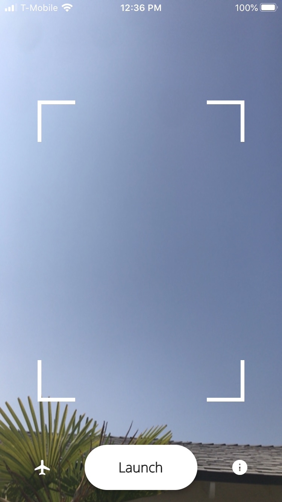
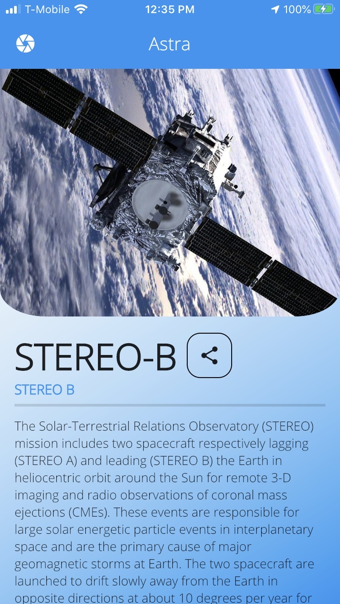
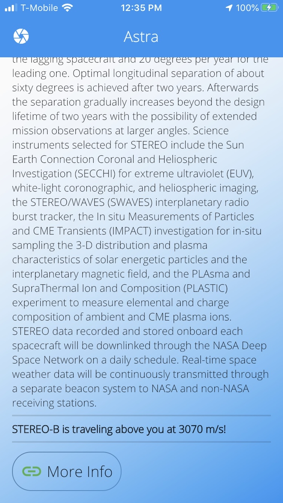

# Astra Server

Input example: `http://127.0.0.1:8080/?x=5&y=-8&z=-3`

Response example: `{
    "Name": "GOES",
    "Velocity": "4430 m/s",
    "Image": "https://img.favpng.com/25/16/15/geostationary-operational-environmental-satellite-weather-satellite-goes-16-png-favpng-04VEAEATWNL6fFi5YAQRsy9jZ.jp",
    "ResourceID": "spase://SMWG/Observatory/GOES",
    "ResourceName": "Geostationary Operational Environmental Satellites",
    "Description": "GOES is a series of NASA-developed, NOAA-operated, geosynchronous, and operational spacecraft."
}`

# Frontend
This API is tailored to the following frontend, created using Flutter:

